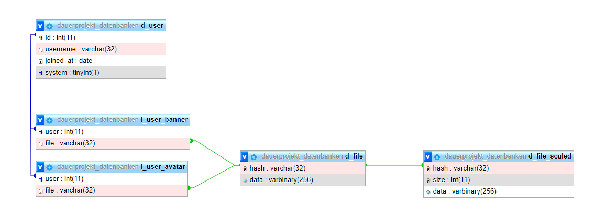

<style> 
  table { width: 100%; } 
  table th, table td { width: 25% } 
</style>



<br>
<br>

# D_USER

| Filed       | TS Type             | SQL Type               | Description                                    |
| ----------- | ------------------- | ---------------------- | ---------------------------------------------- |
| `id`        | `number`            | `INT NOT NULL`         | the user's id                                  |
| `username`  | `string`            | `VARCHAR(32) NOT NULL` | the user's username, not unique across the app |
| `joined_at` | `ISO8601 timestamp` | `DATE NOT NULL`        | when the user joined                           |
| `system`    | `?boolean`          | `BOOLEAN`              | whether the user has system rights             |

```json
{
  "id": "80351110224678912",
  "username": "Nelly",
  "joined_at": "2022-03-27T07:54:12.590Z",
  "system": true
}
```

<br>
<br>

# D_FILE

| Filed  | TS Type    | SQL Type                  | Description         |
| ------ | ---------- | ------------------------- | ------------------- |
| `hash` | string     | `VARCHAR(32) NOT NULL`    | the images's hash   |
| `data` | Uint8Array | `varbinary(max) NOT NULL` | binary of the image |

```json
{
  "hash": "8342729096ea3675442027381ff50dfe",
  "data": <Uint8Array|Blob>
}
```

<br>
<br>

# D_FILE

| Filed  | TS Type    | SQL Type                  | Description         |
| ------ | ---------- | ------------------------- | ------------------- |
| `hash` | string     | `VARCHAR(32) NOT NULL`    | the images's hash   |
| `size` | number     | `INT NOT NULL`            | the image width     |
| `data` | Uint8Array | `varbinary(max) NOT NULL` | binary of the image |

```json
{
  "hash": "8342729096ea3675442027381ff50dfe",
  "size": 128,
  "data": <Uint8Array|Blob>
}
```

<br>
<br>

# L_USER_AVATAR

| Filed  | TS Type | SQL Type | Description |
| ------ | ------- | -------- | ----------- |
| `user` |         |          |             |
| `file` |         |          |             |

```json
{
  "user": "80351110224678912",
  "file": "8342729096ea3675442027381ff50dfe"
}
```

<br>
<br>

# L_USER_BANNER

| Filed  | TS Type | SQL Type | Description |
| ------ | ------- | -------- | ----------- |
| `user` |         |          |             |
| `file` |         |          |             |

```json
{
  "user": "80351110224678912",
  "file": "8342729096ea3675442027381ff50dfe"
}
```
