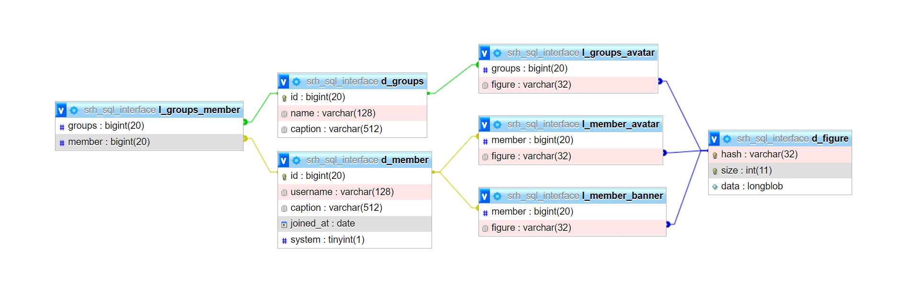

[← Dauerprojekt Datenbanken](../README.md#dauerprojekt-datenbanken)

# Content examples and project objective

The database is intended to be a simple profile manager in the form of a local web server and API, in which users can edit profile elements via a simple interface. Since it is only about writing and reading data, this does not involve any form of security. Anyone can read and write any data.

## API

#### Getting all groups:

```
GET /api/groups
```

Response with JSON –

```json
{
  "groups": [953652184124391529, 953652757825462282]
}
```

#### Getting information about a specific group:

```
GET /api/groups/{group.id}
```

Response with JSON –

```json
{
  "id": "953652184124394458",
  "name": "Aperture Science",
  "avatar": "46e6b522cbf351c41de1ed1fae9ba3a2"
}
```

Response with JSON message; when request is invalid –

```json
{ "message": "404: Not Found", "code": 0 }
```

#### Getting all members of a group:

```
GET /api/groups/{group.id}/members
```

Response with JSON –

```json
{
  "members": [298726187285348353, 298726222848851970, 298726151784759296]
}
```

Response with JSON message; when request is invalid –

```json
{ "message": "404: Not Found", "code": 0 }
```

#### Getting information about a specific member:

```
GET /api/member/{member.id}
```

Response with JSON –

```json
{
  "id": "80351110224678912",
  "username": "Nelly",
  "avatar": "8342729096ea3675442027381ff50dfe",
  "banner": "06c16474723fe537c283b8efa61a30c8",
  "caption": null,
  "system": false
}
```

Response with JSON message; when request is invalid –

```json
{ "message": "404: Not Found", "code": 0 }
```

#### Updating information for a specific member

```
PATCH /api/member/{member.id}
```

Response with JSON message; when request is invalid or accepted –

```json
{ "message": "Done", "code": 1 }
```

```json
{ "message": "Invalid request", "code": 0 }
```

<br>

## CDN

#### Request avatars and banners

```
GET /cdn/avatar/{file.hash}
GET /cdn/banner/{file.hash}
```

Response with data stream –  
Response with 404 document; when request is invalid –

<br>

<!--

## SQL

#### TABLE_USER

| id:number          | username:string | caption:?string                                                            | joined_at:timestamp      | system:?boolean |
| ------------------ | --------------- | -------------------------------------------------------------------------- | ------------------------ | --------------- |
| 298726187285348353 | Alice           |                                                                            | 2022-04-04T10:24:12.590Z |                 |
| 298726222848851970 | Glados          | Cake and grief counseling will be available at the conclusion of the test. | 2007-10-10T00:00:00.002Z | true            |
| 298726151784759296 | Nelly           |                                                                            | 2022-04-04T07:53:36.125Z |                 |
| ...                | ...             | ...                                                                        | ...                      | ...             |

#### TABLE_FILE

| hash:string                      | size:number | data:Uint8Array |
| -------------------------------- | ----------- | --------------- |
| 64d890648f7b31e8841c4441e5d8625c | 128         | ?               |
| 64d890648f7b31e8841c4441e5d8625c | 256         | ?               |
| 31e5e4f2ed037db75390982312c3af9f | 128         | ?               |
| 31e5e4f2ed037db75390982312c3af9f | 256         | ?               |
| 70cb8c5e6af3fa1b933fe1c3ff7d41a3 | 128         | ?               |
| 70cb8c5e6af3fa1b933fe1c3ff7d41a3 | 256         | ?               |
| 46e6b522cbf351c41de1ed1fae9ba3a2 | 128         | ?               |
| 46e6b522cbf351c41de1ed1fae9ba3a2 | 256         | ?               |
| 1a9ffd58f73deb082c59b6062a607b7e | 128         | ?               |
| 1a9ffd58f73deb082c59b6062a607b7e | 256         | ?               |
| ...                              | ...         | ...             |

#### TABLE_USER_AVATAR

| user:string        | file:string                      |
| ------------------ | -------------------------------- |
| 298726151784759296 | 64d890648f7b31e8841c4441e5d8625c |
| 298726187285348353 | 31e5e4f2ed037db75390982312c3af9f |
| 298726222848851970 | 70cb8c5e6af3fa1b933fe1c3ff7d41a3 |
| ...                | ...                              |

#### TABLE_USER_BANNER

| user:string        | file:string                      |
| ------------------ | -------------------------------- |
| 298726151784759296 | 46e6b522cbf351c41de1ed1fae9ba3a2 |
| 298726187285348353 | 46e6b522cbf351c41de1ed1fae9ba3a2 |
| 298726222848851970 | 1a9ffd58f73deb082c59b6062a607b7e |
| ...                | ...                              |

<br>

-->

# Entity Relationship Diagram (ERM)



<br>

# Relations in text notation

#### groups

```sql
CREATE TABLE srh_sql_interface.d_groups (
  id          BIGINT            NOT NULL,
  name        VARCHAR(128)      NOT NULL,

  PRIMARY KEY(id)
);
```

#### member

>

```sql
CREATE TABLE srh_sql_interface.d_member (
  id          BIGINT            NOT NULL,
  name        VARCHAR(128)      NOT NULL,
  caption     VARCHAR(512)      ,
  joined_at   DATE              NOT NULL,
  system      BOOLEAN           ,

  PRIMARY KEY(id)
);
```

#### figure

>

```sql
CREATE TABLE srh_sql_interface.d_figure (
  hash        VARCHAR(32)       NOT NULL,
  size        INT               NOT NULL,
  data        LONGBLOB          NOT NULL,

  PRIMARY KEY(hash, size)
);
```

#### linking groups <-> member

>

```sql
CREATE TABLE srh_sql_interface.l_groups_member (
  groups      BIGINT            NOT NULL,
  member      BIGINT            NOT NULL,

  FOREIGN KEY(groups) references srh_sql_interface.d_groups(id),
  FOREIGN KEY(member) references srh_sql_interface.d_member(id)
);
```

#### linking groups <-> avatar

>

```sql
CREATE TABLE srh_sql_interface.l_groups_avatar (
  groups      BIGINT            NOT NULL,
  figure      VARCHAR(32)       NOT NULL,

  FOREIGN KEY(groups) references srh_sql_interface.d_groups(id),
  FOREIGN KEY(figure) references srh_sql_interface.d_figure(hash)
);
```

#### linking member <-> avatar

>

```sql
CREATE TABLE srh_sql_interface.l_member_avatar (
  member      BIGINT            NOT NULL,
  figure      VARCHAR(32)       NOT NULL,

  FOREIGN KEY(member) references srh_sql_interface.d_member(id),
  FOREIGN KEY(figure) references srh_sql_interface.d_figure(hash)
);
```

#### linking member <-> banner

>

```sql
CREATE TABLE srh_sql_interface.l_member_banner (
  member      BIGINT            NOT NULL,
  figure      VARCHAR(32)       NOT NULL,

  FOREIGN KEY(member) references srh_sql_interface.d_member(id),
  FOREIGN KEY(figure) references srh_sql_interface.d_figure(hash)
);
```
